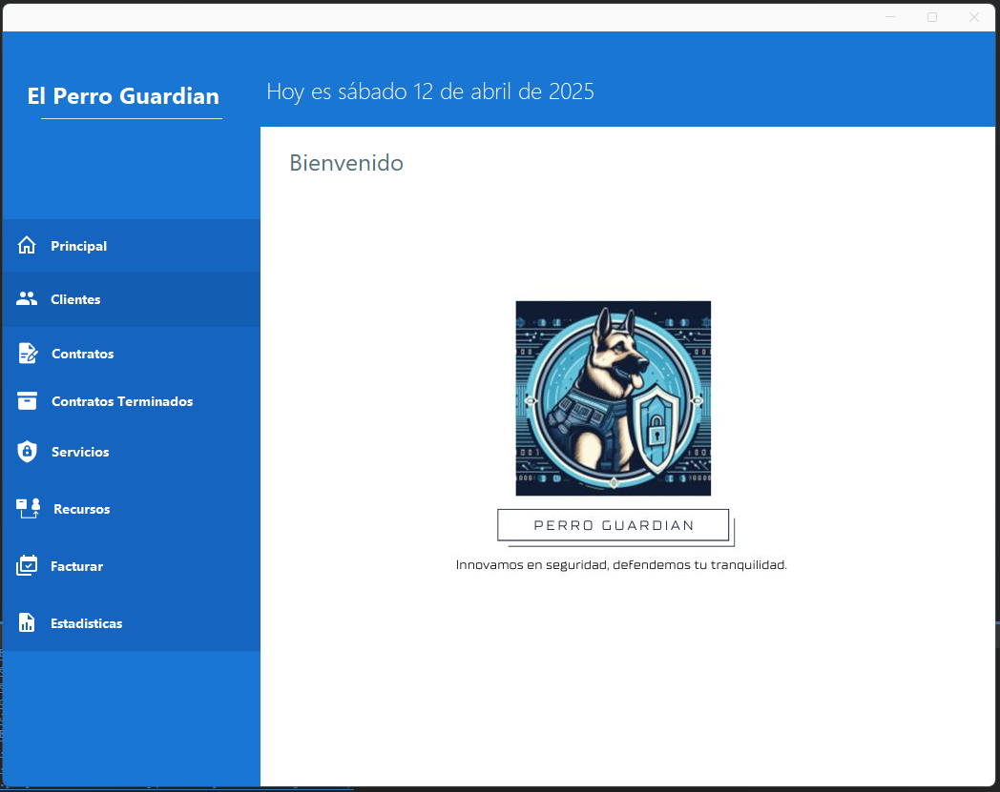

# 🧩 ProyectoFinalLogica2GUI

**ProyectoFinalLogica2GUI** is a desktop application developed in Java with a graphical user interface (Swing), designed to efficiently manage information related to clients, contracts, technology services, and billing. This project follows the MVC architectural pattern and uses `.txt` files for persistent storage.

## 🚀 Key Features

- ✅ Client registration and management  
- ✅ Contract creation and tracking  
- ✅ Management of completed contracts  
- ✅ Management of basic, advanced, and monitoring services  
- ✅ Invoice registration  
- ✅ Visual statistics with integrated charts  
- ✅ Intuitive interface developed with Swing  

## 🧠 Project Architecture

The system is structured using the **Model-View-Controller (MVC)** pattern:

```
src/
├── BaseDatos/               # Handles .txt file data (pseudo-database)
├── Clases/                  # Domain entities (Client, Contract, Service, etc.)
├── controlador/             # Logic controllers for each module
├── com.mycompany.views/     # System's graphical interface (Swing)
├── archivos/                # Persistent .txt files (clients, contracts, etc.)
├── javaswingdev.chart/      # Custom library for pie charts
```

## 💻 Technologies Used

| Technology     | Description                     |
|----------------|---------------------------------|
| Java           | Programming language            |
| NetBeans IDE   | Integrated Development Environment |
| Swing          | Graphical User Interface        |
| .txt Files     | Simulated data persistence      |
| MVC            | System architecture             |

## 📷 Screenshots

### 🔹 Main Dashboard


## ⚙️ How to Run

1. Clone the repository:  
```bash
git clone https://github.com/Cristian-Tg/ProyectoFinalLogica2GUI.git
```

2. Open the project in **NetBeans**
3. Run the class `VentanaPrincipal.java`
4. Done! You can start interacting with the system.

## 🧠 Learnings and Outcomes

- Application of the MVC pattern in Java  
- Data handling using plain text files  
- Creating professional graphical user interfaces  
- Generating visual statistics  
- Modular and object-oriented code structure
